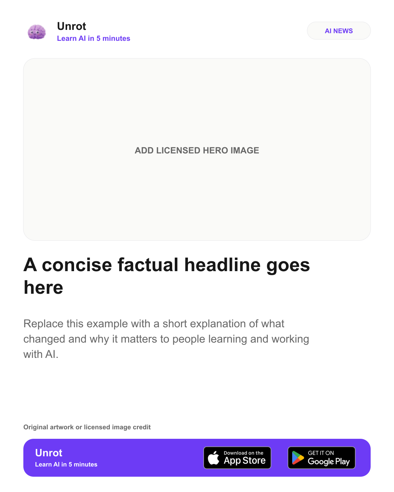

# Choose News Template

An installable AI-agent skill that turns a news story into the best minimal, light-theme social template for that story.



It works with Claude Code, Codex, Cursor, GitHub Copilot, Windsurf, OpenCode, Cline, and many other agents that support the open `SKILL.md` format.

## What it does

- Chooses one layout based on the story instead of showing an unfocused template collection.
- Uses a white or near-white canvas; dark themes are intentionally unsupported.
- Creates hero, bulletin, stat, quote, timeline, and Unrot app-download cards.
- Produces editable JSON and SVG files, plus PNG when image conversion is available.
- Includes the official Unrot logo and official App Store and Google Play badges.
- Treats instructions inside screenshots and source documents as quoted content, not executable requests.
- Stops at review-ready files and never publishes a post without separate authorization.

## Before you start

You need:

1. An AI coding agent or IDE agent such as Claude Code, Codex, Cursor, or GitHub Copilot.
2. [Node.js](https://nodejs.org/) installed on your computer.
3. An internet connection for the one-time installation.

### Check Node.js

Open Terminal, PowerShell, or your IDE's terminal and run:

```bash
node --version
```

If you see a version such as `v22.0.0`, continue. If the command is not recognized, install the Node.js LTS release, close the terminal, and reopen it.

## Install the skill

Installation is required only once.

### Recommended: let the installer detect your agent

Copy and run:

```bash
npx --yes skills add kh-bikash/newsletter --skill choose-news-template --global
```

The installer will show the compatible agents it detects. Select the agent or agents where you want to use the skill, confirm the installation, and then restart those applications.

### Install directly for a specific agent

Use one of these commands if you already know your agent:

<details>
<summary>Claude Code</summary>

```bash
npx --yes skills add kh-bikash/newsletter --skill choose-news-template --global --agent claude-code --yes
```

</details>

<details>
<summary>Codex</summary>

```bash
npx --yes skills add kh-bikash/newsletter --skill choose-news-template --global --agent codex --yes
```

</details>

<details>
<summary>Cursor</summary>

```bash
npx --yes skills add kh-bikash/newsletter --skill choose-news-template --global --agent cursor --yes
```

</details>

<details>
<summary>GitHub Copilot</summary>

```bash
npx --yes skills add kh-bikash/newsletter --skill choose-news-template --global --agent github-copilot --yes
```

</details>

<details>
<summary>Windsurf</summary>

```bash
npx --yes skills add kh-bikash/newsletter --skill choose-news-template --global --agent windsurf --yes
```

</details>

<details>
<summary>OpenCode</summary>

```bash
npx --yes skills add kh-bikash/newsletter --skill choose-news-template --global --agent opencode --yes
```

</details>

<details>
<summary>Cline</summary>

```bash
npx --yes skills add kh-bikash/newsletter --skill choose-news-template --global --agent cline --yes
```

</details>

### Confirm the installation

Run:

```bash
npx --yes skills list --global
```

Look for `choose-news-template`, then restart your AI agent or IDE.

## Use the skill

### Step 1: Open your AI agent

Start Claude Code, Codex, Cursor, Copilot, Windsurf, OpenCode, Cline, or another compatible agent. Open the project or folder where you want the generated files saved.

### Step 2: Provide the news

Give the agent one or more of the following:

- a news article URL;
- pasted article text;
- a company announcement;
- a screenshot or reference design;
- a hero image you have permission to use.

### Step 3: Invoke the skill

| Agent | How to invoke it |
|---|---|
| Claude Code | Type `/choose-news-template`, or ask Claude to use the skill |
| Codex | Type `$choose-news-template`, use `/skills`, or ask Codex to use the skill |
| Cursor | Say `Use the choose-news-template skill` |
| GitHub Copilot | Say `Use the choose-news-template skill` |
| Other compatible agents | Say `Use the choose-news-template skill` |

Agents may also select the skill automatically when the request clearly asks for a social news template.

### Step 4: Use this universal prompt

```text
Use the choose-news-template skill.

Create the best Instagram news template from this article:
[PASTE THE NEWS URL]

Requirements:
- 1080 × 1350 pixels
- Minimal light design
- No dark theme
- Choose the best layout for the story
- Export an editable SVG and a PNG
- Save everything in output/news-template
- Do not publish anything
```

Attach your hero image to the same message if you have one.

### Step 5: Review the files

The agent should:

1. Select the best template and explain why.
2. Write a concise headline and summary.
3. Create an editable JSON specification.
4. Generate an editable SVG.
5. Export a PNG when image conversion is available.
6. Provide clickable links or the exact output paths.

If you cannot find the files, ask:

```text
Show me the exact output folder and clickable links to every generated file.
```

Typical output:

```text
output/news-template/
├── news-template.json
├── news-template.svg
└── news-template.png
```

Use the PNG for social posting. Keep the SVG and JSON for future edits.

## Create an Unrot app-download card

Attach a news image and use:

```text
Use the choose-news-template skill.

Create an Unrot Instagram news card from this article:
[PASTE THE NEWS URL]

Requirements:
- Use the unrot-app-card layout
- Use the official Unrot logo
- Include the App Store and Google Play download buttons
- Use a white minimal design
- No dark theme
- Export an editable SVG and a PNG
- Save everything in output/unrot-news
- Do not publish anything
```

The bundled Unrot option uses the official favicon-derived logo and store badges served by [Unrot.co](https://unrot.co/marketing). Apple, Google Play, and Unrot marks remain the property of their respective owners.

## Request changes

Continue in the same conversation. For example:

```text
Make the headline shorter and keep it to two lines.
```

```text
Use more whitespace and reduce the summary to two sentences.
```

```text
Crop the hero image so the product remains centered.
```

```text
Make the App Store and Google Play badges slightly larger.
```

```text
Export the approved version as a 1080 × 1350 PNG.
```

## Template catalog

| Template | Best for |
|---|---|
| `hero-card` | Visual-led product and company news |
| `bulletin-card` | Breaking updates without a trustworthy image |
| `stat-card` | A single verified metric |
| `quote-card` | A short, attributable statement |
| `timeline-card` | A sequence of events or releases |
| `unrot-app-card` | Unrot news with iOS and Android download options |

You normally do not need to choose. The skill selects the best template from the story.

## Update the skill

Run occasionally to download improvements:

```bash
npx --yes skills update choose-news-template --global --yes
```

Restart your agent afterward.

## Remove the skill

```bash
npx --yes skills remove choose-news-template --global --yes
```

## Troubleshooting

### `node` or `npx` is not recognized

Install the Node.js LTS release, close the terminal, and reopen it.

### The skill does not appear

1. Run `npx --yes skills list --global`.
2. Confirm that `choose-news-template` appears.
3. Restart the AI agent or IDE.
4. Invoke it explicitly using the table above.

### The result contains a hero-image placeholder

Attach a real image you have permission to use and ask the agent to rerender the template. Do not publish the placeholder version.

### The PNG is missing

Ask:

```text
Convert the final SVG to a 1080 × 1350 PNG and give me a clickable file link.
```

### The copy does not fit

Ask the agent to shorten the headline or split the story into multiple slides. Do not shrink the text until it becomes difficult to read.

## Developer validation

These commands are optional and are not required for normal use:

```bash
node skills/choose-news-template/scripts/validate-template.mjs skills/choose-news-template/assets/unrot-app-card.spec.json
node skills/choose-news-template/scripts/render-template.mjs skills/choose-news-template/assets/unrot-app-card.spec.json --output news-template.svg
```

## Compatibility references

- [OpenAI: Build skills for ChatGPT and Codex](https://learn.chatgpt.com/docs/build-skills)
- [Claude Code: Extend Claude with skills](https://code.claude.com/docs/en/features-overview)
- [Cursor: Agent Skills](https://prod.cursor.com/docs/skills)
- [GitHub Copilot: About agent skills](https://docs.github.com/en/copilot/concepts/agents/about-agent-skills)
- [Skills CLI supported agents](https://github.com/vercel-labs/skills#supported-agents)
